# 연습 1: Azure IoT 서비스 시작

## 시나리오

Fabrikam, Inc.의 *터빈(디바이스)*은 전 세계 여러 곳에 배포되어 있습니다. 모든 디바이스를 중앙에서 확장 가능한 안정적인 방식으로 관리하고 원격 분석을 수신하도록 Azure IoT Hub 솔루션을 구성해야 합니다.

## 개요

이 연습에서는 전 세계에 배포된 디바이스를 Azure IoT Hub에 연결하고, 터빈 디바이스에서 Azure IoT Hub로 원격 분석 데이터 전송을 시작합니다.

이 연습에서 수행할 활동은 다음과 같습니다.

* Azure Portal에 로그인하여 미리 작성된 Azure IoT Hub 및 기타 리소스 확인 
* Azure IoT Hub에 시뮬레이트된 디바이스 등록
* 시뮬레이트된 디바이스를 사용하도록 설정
* 디바이스에서 Azure IoT Hub로 원격 분석 전송
* Azure IoT Hub IoT 탐색기에서 원격 분석 데이터 스트림 검토

## 지침

### 랩 시작

1. 환경이 프로비전되면 왼쪽의 가상 머신(JumpVM)과 오른쪽의 랩 가이드가 브라우저에 로드됩니다. 워크샵 전 과정에서 이 가상 머신을 사용하여 랩을 수행하게 됩니다.

1. 랩 환경 세부 정보를 확인하려는 경우 **랩 환경** 탭을 선택하면 됩니다. **랩 환경** 탭은 환경 오른쪽 위에 있습니다. 그리고 등록 중에 입력한 전자 메일 주소로 자격 증명이 포함된 전자 메일도 전송됩니다.

   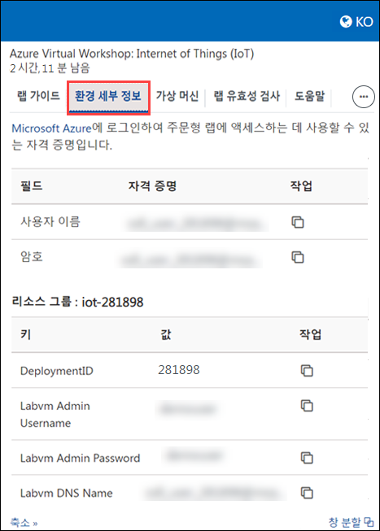

 > 접두사/배포 ID 값도 **랩 환경** 탭에서 확인할 수 있습니다. 랩의 단계에서 접두사나 배포 ID를 입력해야 할 때 이러한 정보를 사용하면 됩니다. 접두사/배포 ID는 각 랩 배포에 해당하는 고유한 번호입니다. 
 
#### 작업 1: Azure Portal에 로그인하여 미리 배포된 리소스 확인

1. JumpVM에서 바탕 화면의 Azure Portal 바로 가기를 두 번 클릭합니다.

   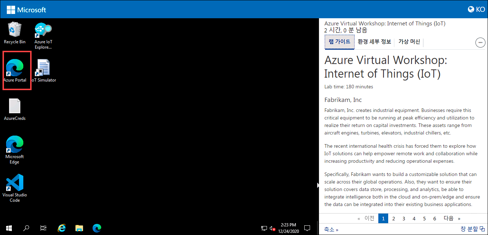  

1. **Microsoft Azure에 로그인** 블레이드에 로그인 화면이 표시됩니다. 이 화면에 다음 전자 메일/사용자 이름을 입력하고 **다음**을 클릭합니다. 
   * 전자 메일/사용자 이름: <inject key="AzureAdUserEmail"></inject>

1. 다음 암호를 입력하고 **로그인**을 클릭합니다.
   * 암호: <inject key="AzureAdUserPassword"></inject>

1. **로그인 상태를 유지하시겠습니까?** 팝업이 표시되면 예를 클릭합니다.

1. **무료 Azure Advisor 추천이 있습니다!** 팝업이 표시되면 창을 닫고 랩을 계속 진행합니다.

1. **Microsoft Azure 시작** 팝업 창이 표시되면 **나중에**를 클릭하여 둘러보기를 건너뜁니다.
   
1. **리소스 그룹** 메뉴를 열려면 Azure Portal 창 왼쪽 위의 토글 메뉴 아이콘을 클릭하고 **리소스 그룹**을 클릭합니다.

   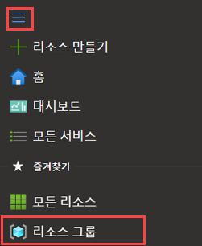

   이 블레이드에는 Azure 구독 액세스 권한이 있는 모든 리소스 그룹이 표시됩니다.

1. 미리 작성된 리소스의 이름은 **iot-{deployment-id}**입니다. 이 리소스 그룹에는 랩에서 필요한 리소스가 모두 포함되어 있습니다. 해당 리소스 그룹을 선택하고 리소스 그룹의 미리 작성된 리소스를 검토합니다. 

   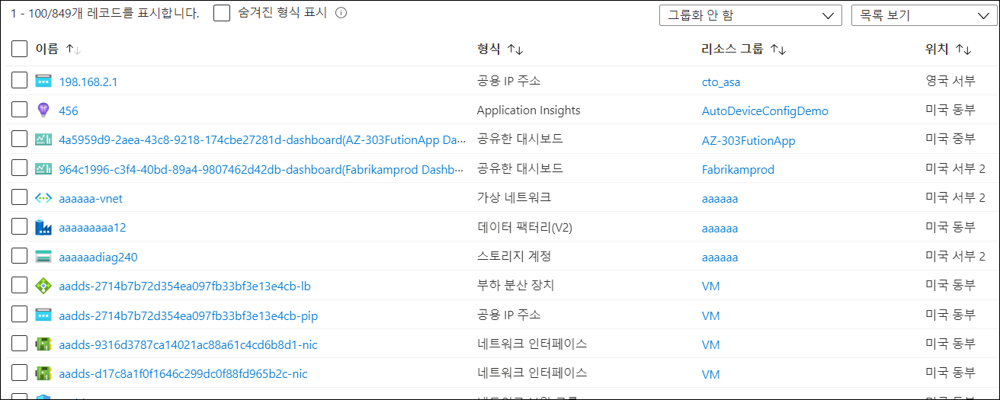  

   > **참고:** **배포 ID**는 배포별로 고유한 번호입니다. 환경 오른쪽 위의 **랩 환경** 탭에서 배포 ID를 확인할 수 있습니다.
    
#### 작업 2: Azure IoT Hub에 시뮬레이트된 터빈 디바이스 연결

**IoT Hub**는 IoT 디바이스에서 전송되는 대량의 원격 분석을 저장 또는 처리용으로 클라우드에 수집할 수 있는 Azure 서비스입니다. IoT Hub에 대한 추가 참조는 다음 링크에서 확인할 수 있습니다. ```https://docs.microsoft.com/en-us/azure/iot-hub/about-iot-hub```.

이 작업에서는 Fabrikam, Inc.의 터빈 디바이스를 Azure IoT Hub에 연결합니다. 연결이 완료되면 IoT Hub로 원격 분석을 전송하도록 터빈 디바이스를 구성합니다. 이 작업에서 수행할 대략적인 단계는 다음과 같습니다.

   * IoT Hub에 터빈 디바이스 등록
   * 솔루션에 포함할 등록된 디바이스를 사용하도록 설정
   * 디바이스에서 IoT Hub로 데이터 전송 시작


1. 오른쪽의 **환경 세부 정보** 탭에서 **IotHubConnectionString**의 값을 복사합니다. 다음 단계에서 이 연결 문자열을 사용하여 IoT Hub와 시뮬레이터 앱 간의 연결, 그리고 Azure IoT 탐색기와의 연결을 설정합니다.

    > **참고**: IoT Hub로 이동하여 설정 아래에서 공유 액세스 정책을 클릭한 다음, 정책 탭 아래에서 iothubowner를 클릭하고 연결 문자열 - 기본 키 값을 복사하는 방식으로 연결 문자열을 가져올 수도 있습니다.

1. Azure Portal을 최소화한 다음 가상 머신 바탕 화면에서 **IoT 시뮬레이터** 바로 가기를 클릭하여 **IoT 시뮬레이터 앱**을 엽니다. 

1. 앞 단계에서 복사한 **연결 문자열** 값을 텍스트 상자에 붙여넣습니다.

1. 오른쪽의 **연결** 단추를 클릭하여 IoT Hub와의 연결을 설정합니다.

1. 연결이 정상적으로 설정되면 **연결 성공** 팝업 메시지가 표시됩니다. **확인**을 클릭하면 터빈 티바이스 목록을 확인할 수 있습니다. 여기서는 각 디바이스에 대해 디바이스 설치를 시뮬레이트합니다.

   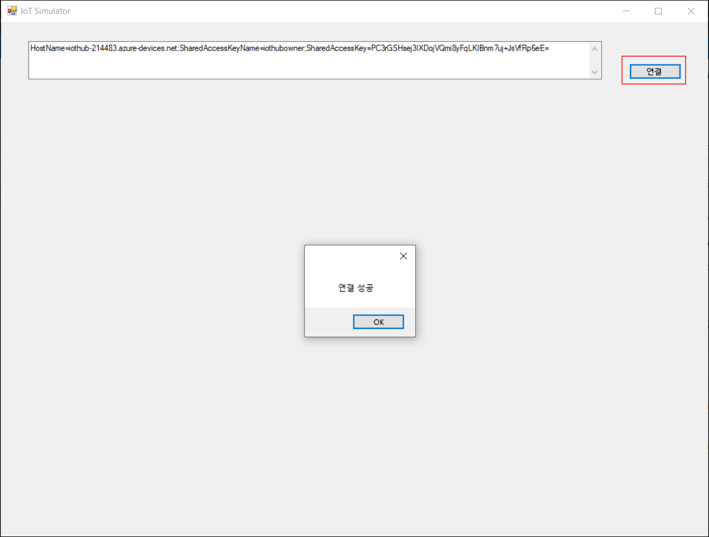
   
1. IoT 시뮬레이터 앱 대화 상자에서 **turbine-01** 옆의 **등록**을 클릭하여 IoT Hub에 디바이스를 등록합니다.

   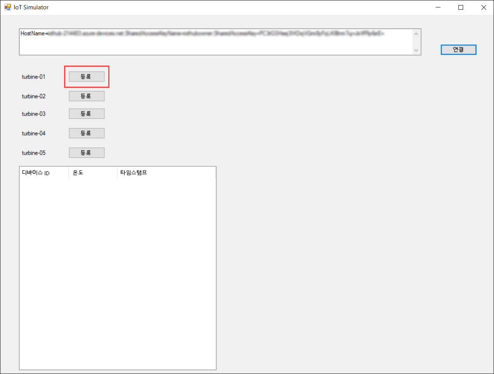

1. **IoT Hub 시뮬레이터 앱**을 최소화하고 리소스 그룹으로 이동하여 IoT Hub **iothub-{deployment-id}**을(를) 선택합니다.

1. 탐색기 섹션 아래에서 **IoT 디바이스**를 클릭하면 등록된 IoT 디바이스가 나열됩니다.
 
   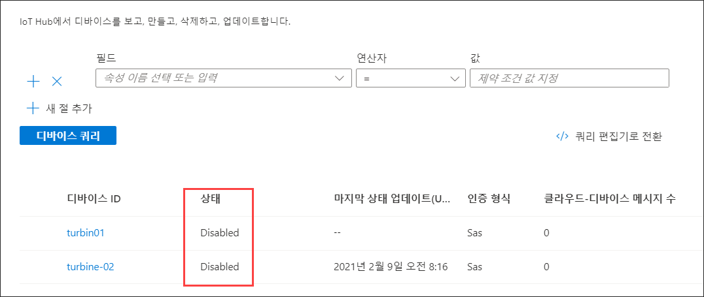

1. IoT 시뮬레이터 탭을 열고 등록된 디바이스 옆의 **활성화** 단추를 클릭하여 IoT Hub 레지스트리에서 디바이스 상태를 disabled(사용 안 함)에서 enabled(사용)로 변경하는 과정을 시뮬레이트합니다.

   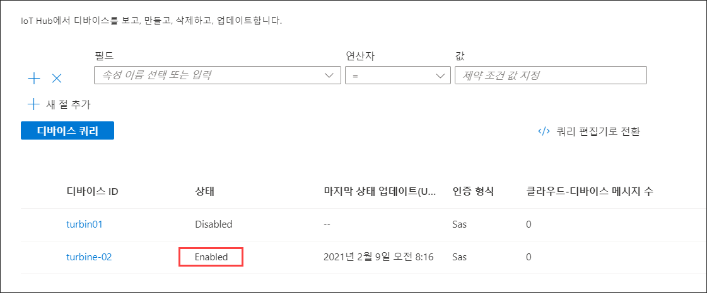

   > **참고: 위의 단계를 반복하여 모든 디바이스를 등록 및 활성화합니다**. 
                  
1. 지금까지 디바이스를 등록하고 활성화했습니다. 이 디바이스 목록을 확인하려면 Azure Portal로 전환하여 IoT Hub **iothub-{deployment-id}**을(를) 선택합니다.

  > **참고: 디바이스를 확인하려면 브라우저를 새로 고쳐야 할 수 있습니다**. 

1. IoT Hub 블레이드에서 왼쪽 메뉴의 탐색기 아래에 있는 IoT 디바이스를 선택합니다.

1. 모든 디바이스가 나열되며, 활성화한 디바이스의 상태는 enabled(사용)로 표시됩니다.

1. IoT 시뮬레이터 애플리케이션으로 다시 이동하여 **원격 분석 보내기**를 클릭합니다. 몇 분 내에 전송된 각 원격 분석 메시지와 시뮬레이트된 온도 값이 시뮬레이터 애플리케이션의 표에 나열됩니다.

   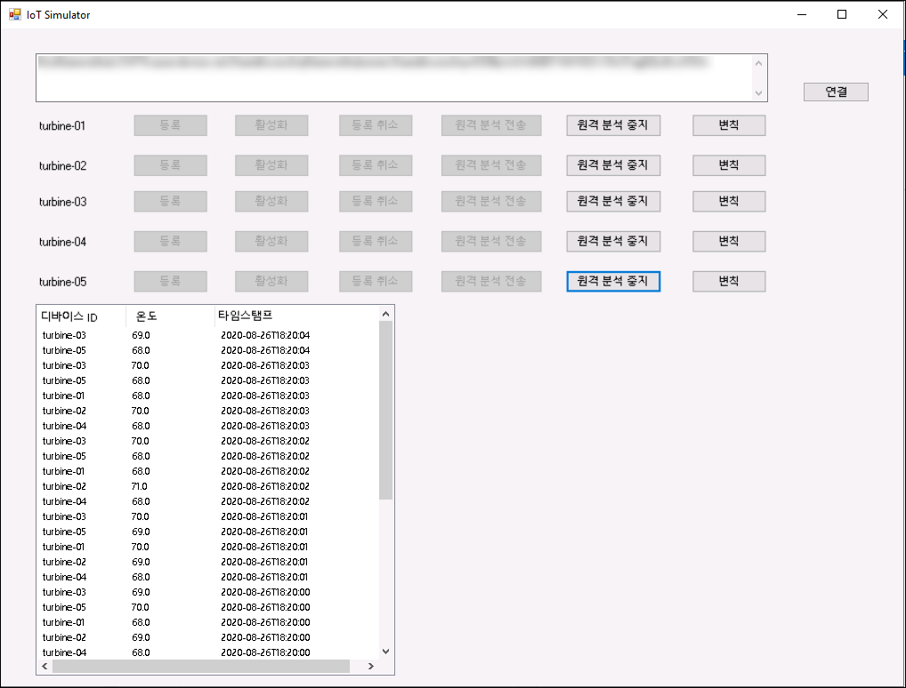
   
   지금까지 Azure IoT Hub로 온도 데이터를 전송하도록 터빈을 구성했습니다. 
   
#### 작업 3: IoT 탐색기를 사용하여 Azure IoT Hub에서 원격 분석 스트림 확인

**Azure IoT 탐색기**는 IoT 플러그 앤 플레이 미리 보기 디바이스 테스트 및 상호 작용에 사용되는 그래픽 도구입니다. 이 도구를 사용하면 디바이스가 전송하는 원격 분석을 확인하고, 디바이스 속성 관련 작업을 수행하고, 명령을 호출할 수 있습니다. 다음 링크를 방문하면 Azure IoT 탐색기에 대해 자세히 알아볼 수 있습니다. ```https://docs.microsoft.com/en-us/azure/iot-pnp/howto-use-iot-explorer```

이 작업에서는 **Azure IoT 탐색기**를 사용하여 시뮬레이트된 터빈 디바이스가 Azure IoT Hub로 전송한 원격 분석 데이터를 검토합니다.

1. 가상 머신 바탕 화면에서 **Azure IoT 탐색기** 바로 가기를 클릭하여 Azure IoT 탐색기 애플리케이션을 시작합니다.

1. IoT Hub 창에서 **+ 연결 추가**를 클릭합니다.

   

1. IoT Hub의 **연결 문자열** 값을 입력합니다. 이 값은 지난 작업에서 터빈 디바이스를 연결할 때 사용한 값입니다.

   > **참고**: 작업 영역 오른쪽의 **환경 세부 정보** 탭 아래 **IoTHubConnectionString**에서 **연결 문자열** 값을 확인할 수 있습니다.
   
1. **저장**을 클릭합니다.

   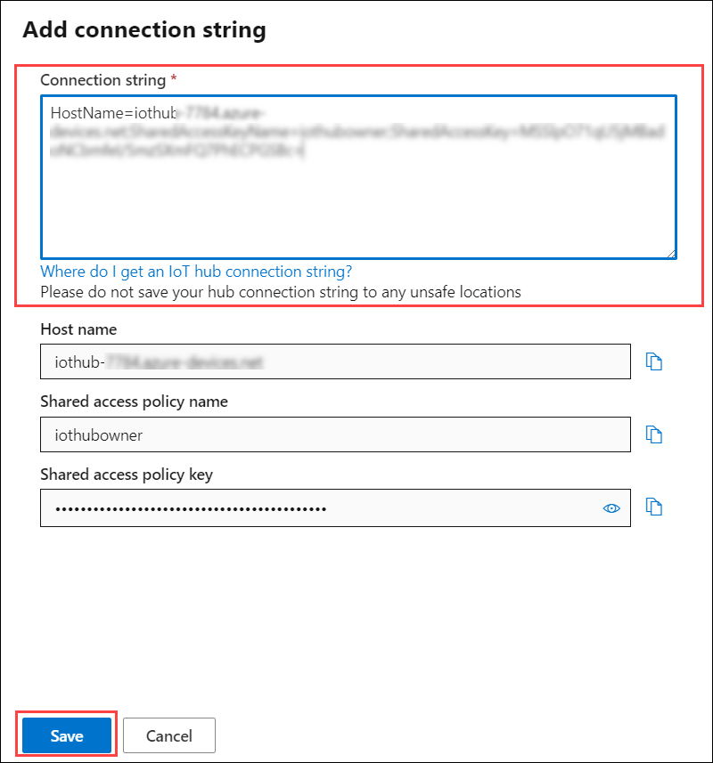

1. 이전 작업에서 연결 및 등록한 **IoT 디바이스**가 **디바이스** 창 아래에 표시됩니다.

1. 디바이스 목록에서 **turbine-01**을 클릭합니다.

   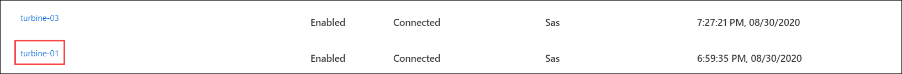

1. 왼쪽에서 **원격 분석**을 선택하고 **시작** 옵션을 클릭합니다.

   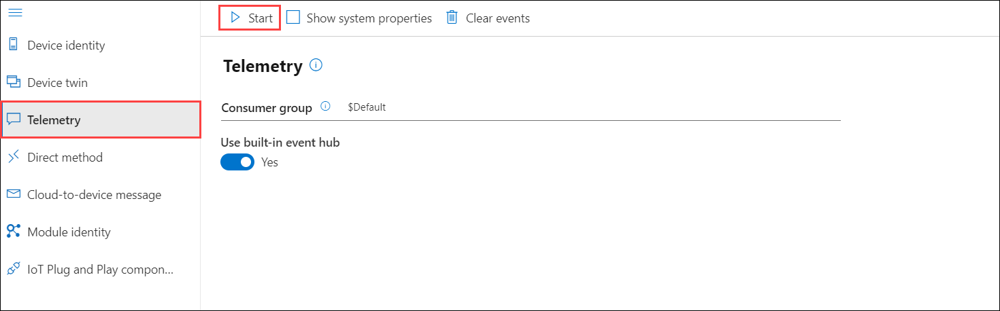

   그러면 IoT Hub로 전송되는 데이터를 모니터링할 수 있습니다. 그리고 디바이스가 IoT Hub에 연결하여 통신할 수 있는지도 확인할 수 있습니다.

1. 2~3분 내에 원격 분석 데이터가 수신되고 다음과 같은 메시지가 표시됩니다. 샘플 데이터에서 온도 값을 검토합니다. 
    
   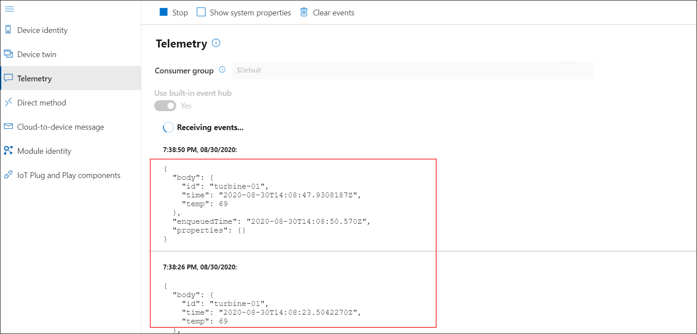
  
1. IoT Hub가 Fabricam, Inc.의 터빈 디바이스에서 원격 분석을 수신하고 있음을 확인한 후 **중지**를 눌러 **Azure IoT 탐색기** 애플리케이션을 닫습니다.

   
   
이 연습에서는 Fabrikam, Inc.의 터빈 디바이스를 Azure IoT Hub에 연결했습니다. 그리고 디바이스가 IoT Hub에 원격 분석을 보내도록 설정했으며, 원격 분석 스트림을 확인했습니다.
