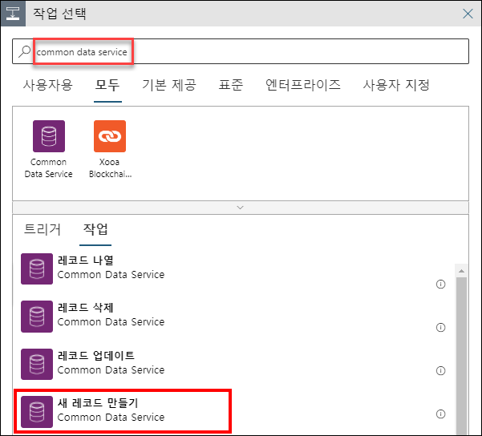

# 연습 3: IoT의 기계 학습 기능 및 Power BI를 사용한 실시간 모니터링

## 시나리오

현재까지 생성된 인사이트에서 변칙을 검색하려면 수동 작업을 수행해야 합니다. Fabrikam은 AI(인공 지능) 분야의 최첨단 기술을 활용하여 온도 데이터의 변칙을 검색하고자 합니다.  또한 모든 변칙 검색에서 자동화된 경고를 구성하고, 데이터 스트림에서 변칙 정보를 실시간으로 모니터링하고자 합니다.   

기계 학습을 사용하여 수동 작업을 수행하지 않고도 변칙을 검색하는 솔루션을 구성해야 합니다. 그리고 여러 차원에서 데이터 스트림 실시간 모니터링을 지원해야 하며, 변칙이 검색될 때마다 팀에 알림을 전송하는 경고를 구성해야 합니다.

## 개요

이 연습에서는 자동화된 기본 제공 기계 학습 모델을 사용하여 터빈 디바이스의 데이터를 분석해 변칙을 검색합니다. 그리고 이전 연습에서 사용했던 쿼리의 출력을 사용해 Power BI 대시보드에 실시간 데이터를 시각화합니다.

이 연습에서는 다음 작업을 수행합니다.

* IoT 시뮬레이터 앱을 사용하여 변칙 트리거
* 기본 제공 기계 학습 모델을 사용하여 변칙 검색
* Power BI 대시보드를 만들어 변칙 데이터 시각화
* 변칙이 검색될 때마다 알림을 전송하도록 경고 구성

### 작업 1: IoT 시뮬레이터 앱을 사용하여 변칙 트리거

IoT 시뮬레이터 애플리케이션에는 데모용으로 변칙을 트리거하는 옵션이 포함되어 있습니다. 이 작업에서 해당 기능을 사용합니다.

1. **IoT 시뮬레이터 앱**이 실행되고 있지 않으면 VM 바탕 화면에서 앱을 시작합니다. 시뮬레이터가 IoT Hub에 연결되어 있으며 원격 분석 데이터를 전송하고 있는지 확인합니다. 

1. IoT 시뮬레이터 앱 대화 상자에서 원격 분석 중지 옆의 **변칙** 단추를 클릭합니다. 그러면 IoT Hub로 변칙을 전송하는 과정이 트리거됩니다.

    > **참고**: 디바이스가 원격 분석을 전송하지 않는 경우 IoT 시뮬레이터 앱을 시작하고 원격 분석을 전송하여 디바이스를 시뮬레이션합니다.
    
1. 전송된 원격 분석 메시지 목록이 표에 표시됩니다. 시뮬레이트된 온도 값을 관찰합니다. 온도 값이 갑자기 커지는 현상을 확인할 수 있습니다.

### 작업 2: 기본 제공 기계 학습 모델을 사용하여 변칙 검색

이 작업에서는 기본 제공 ML 모델을 사용하여 변칙을 검색합니다.

**기본 제공 기계 학습 모델** - AnomalyDetection_SpikeAndDip 함수는 슬라이딩 윈도우를 사용하여 데이터를 분석해 변칙 유무를 확인합니다. 최근 2분 동안의 원격 분석 데이터 등을 슬라이딩 윈도우로 사용할 수 있습니다. 슬라이딩 윈도우는 원격 분석 흐름에 따라 거의 실시간에 가깝게 변경됩니다. 슬라이드 윈도우 크기가 커져서 데이터가 더 많이 포함되면 변칙 검색 정확도도 높아집니다. 하지만 대기 시간도 길어지므로 균형을 잘 맞춰야 합니다.

1. 리소스 그룹 타일에서 **iot-{deployment-id}**을(를) 클릭하고 Stream Analytics 작업 **iot-streamjob-{deployment-id}**을(를) 선택합니다. Stream Analytics 작업이 실행되고 있으면 중지합니다.

   > **참고**: 다음 단계에서 쿼리를 편집하기 전에 Stream Analytics 작업이 **중지**되어 있는지 확인하세요.

1. 왼쪽 메뉴의 **작업 토폴로지** 아래에서 **쿼리**를 클릭합니다.

1. 다음 SQL 쿼리를 복사하여 기존 쿼리 대신 입력합니다.

    ```sql
     WITH AnomalyDetectionStep AS
     (
       SELECT
           EventProcessedUtcTime AS time,
           CAST(temp AS float) AS temp,
           AnomalyDetection_SpikeAndDip(CAST(temp AS float), 90, 120, 'spikesanddips')
               OVER(LIMIT DURATION(second, 120)) AS SpikeAndDipScores
       FROM iothubinput
    )
       SELECT
           time,
           temp,
           CAST(GetRecordPropertyValue(SpikeAndDipScores, 'Score') AS float) AS
           SpikeAndDipScore,
           CAST(GetRecordPropertyValue(SpikeAndDipScores, 'IsAnomaly') AS bigint) AS
           IsSpikeAndDipAnomaly
      INTO powerbioutput
      FROM AnomalyDetectionStep;
      
      SELECT * INTO bloboutput FROM iothubinput;
      
      SELECT AVG(temp) AS AverageTemperature, id INTO servicebusoutput FROM iothubinput GROUP BY TumblingWindow(minute, 1), id HAVING AVG(temp) > 72 ;
    ```

    > **참고**:  이 쿼리의 첫 섹션에서는 온도 데이터를 가져온 다음 이전 120초 동안의 데이터를 검사합니다. `AnomalyDetection_SpikeAndDip` 함수는 `Score` 매개 변수와 `IsAnomaly` 매개 변수를 반환합니다. ML 모델이 지정된 값을 변칙으로 간주하는 확신도가 백분율로 지정된 점수로 표시됩니다. 점수가 90%보다 높으면 `IsAnomaly` 매개 변수의 값은 1로 설정되고 그렇지 않으면 `IsAnomaly`의 값은 0으로 설정됩니다. 쿼리의 첫 섹션에는 120 및 90 매개 변수가 있습니다. 쿼리의 두 번째 섹션에서는 `powerbioutput`으로 시간, 온도 및 변칙 매개 변수를 전송합니다.
 
    > **참고**: 쿼리의 세 번째 섹션인 **SELECT AVG(temp) AS AverageTemperature, id INTO servicebusoutput FROM iothubinput GROUP BY TumblingWindow(minute, 1), id HAVING AVG(temp) > 72 ;**에서는 "iothubinput" 입력으로 들어오는 이벤트를 확인한 다음 1분 단위 연속 창으로 이벤트를 그룹화합니다. 그런 다음 72도보다 높은 평균 온도와 id를 "servicebusoutput" 출력으로 전송합니다. `TumblingWindow` 함수에 대한 자세한 내용은 ```https://docs.microsoft.com/en-us/stream-analytics-query/tumbling-window-azure-stream-analytics``` 링크를 참조하세요.

1. 쿼리 편집기에 다음과 같이 입력 하나와 출력 3개가 표시되어 있는지 확인합니다.

    * `Inputs`
      * `iothubinput`
    * `Outputs`
      * `bloboutput`
      * `powerbioutput`     
      * `servicebusoutput`

    위의 각 항목이 2개 이상 표시된다면 입력이나 출력에 사용한 이름 또는 쿼리에 오타가 있을 가능성이 높습니다. 계속 진행하기 전에 문제를 해결하세요.

1. **쿼리 저장**을 클릭하여 쿼리를 저장합니다.

1. 왼쪽 메뉴에서 **개요**를 클릭합니다.

1. 블레이드 위쪽에서 **시작**을 클릭하여 분석 작업을 시작합니다.

   > **참고**: Stream Analytics 작업이 실패하면 다음 단계를 수행합니다.
     *  작업 토폴로지 아래의 **출력**을 선택한 다음 **powerbioutput**을 선택합니다.
     * PowerBi 출력 블레이드에서 권한 갱신을 클릭합니다. Azure 자격 증명을 입력하라는 메시지가 표시되면 환경 세부 정보 탭에 나와 있는 Azure 사용자 이름과 암호를 입력하고 저장을 클릭합니다.

1. **작업 시작** 창의 **작업 출력, 시작 시간** 아래에서 **지금**이 선택되어 있는지 확인하고 **시작**을 클릭합니다.

운영자가 이 쿼리의 출력을 쉽게 해석할 수 있도록 하려면 데이터를 이해하기 쉬운 방식으로 시각화해야 합니다. 이러한 시각화 방식 중 하나가 Power BI 대시보드를 만드는 것입니다. 다음 연습에서 Power BI 대시보드를 만들어 보겠습니다.

### 작업 3: Power BI 대시보드를 만들어 변칙 데이터 시각화

이전 작업에서는 ML 모델을 통해 원격 분석을 처리하도록 Stream Analytics 작업을 구성했으며, Power BI에 작업 결과를 출력했습니다. 이번에는 운영자가 결과를 확인한 후 결정을 내릴 수 있도록 Power BI 내에서 결과를 시각화할 타일 몇 개가 포함된 대시보드를 만들어야 합니다.

여기서는 실시간으로 데이터를 분석하기 위해 Power BI의 기본 제공 기능을 사용합니다. 그리고 Power BI용으로 실시간 형식 데이터를 전송하는 Azure Stream Analytics의 기능도 사용합니다.

Power BI의 대시보드 기능을 사용하여 시각화 타일을 만들어 보겠습니다. 첫 번째 타일에는 평균 온도 측정값이 표시되고, 두 번째 타일(계기)에는 값이 변칙일 가능성의 신뢰 수준(0.0~1.0)이 표시됩니다. 세 번째 타일에는 신뢰 수준이 90% 이상인지가 표시됩니다. 마지막으로 네 번째 타일에는 지난 1시간 동안 검색된 변칙의 수가 표시됩니다. 이 타일에는 시간이 X축으로 포함되어 있으므로 단시간 내에 여러 변칙이 검색되었는지를 명확하게 파악할 수 있습니다. 연속으로 검색된 변칙이 가로 군집 형태로 함께 표시되기 때문입니다.

이 네 번째 타일에서는 변칙을 서로 비교할 수도 있습니다.

1. 브라우저에서 ```https://app.powerbi.com/```으로 다시 이동합니다.

1. Power BI가 열리면 왼쪽 탐색 메뉴에서 **작업 영역**을 확장하고 **내 작업 영역**을 선택합니다.

1. **데이터 세트** 탭에서 **temperaturedataset**가 표시되어 있는지 확인합니다.
   
1. 내 작업 영역 페이지에서 **+ 새로 만들기**를 클릭하고 드롭다운에서 **대시보드**를 선택합니다.

1. **대시보드 만들기** 팝업의 **대시보드 이름** 아래에 **Temperature Dash(온도 대시보드)**를 입력하고 **만들기**를 클릭합니다.

    새 대시보드는 빈 페이지로 표시됩니다.

1. Temperature 계기를 추가하려면 빈 대시보드 위쪽에서 **편집**을 클릭하고 **+ 타일 추가**를 선택합니다.

1. **타일 추가** 창의 **실시간 데이터** 아래에서 **사용자 지정 스트리밍 데이터**를 클릭하고 **다음**을 클릭합니다.

1. **사용자 지정 스트리밍 데이터 추가** 창의 **데이터 세트** 아래에서 **temperaturedataset**를 클릭하고 **다음**을 클릭합니다.

    창이 새로 고쳐지며, 그러면 시각화 형식과 필드를 선택할 수 있습니다.

1. **시각화 형식** 아래에서 드롭다운을 열고 **계기**를 클릭합니다.

1. **값** 아래에서 **+ 값 추가**를 클릭하고 드롭다운을 연 다음 **temp**를 클릭합니다.

    계기가 대시보드에 즉시 표시되며 값이 업데이트되기 시작합니다.

    
    
    > **참고**:  **temp**가 표시되지 않으면 IoT 시뮬레이터 앱과 Stream Analytics 작업이 실행되고 있는지 확인하세요. 2분 동안 변칙 전송을 중지했다가 다시 전송을 시작하고 3~5분 정도 기다려 볼 수도 있습니다. 그런 다음 페이지를 새로 고쳐서 값이 표시되는지 확인하세요. 그래도 값이 표시되지 않으면 디바이스를 비활성화하여 IoT 시뮬레이터 앱에 다시 연결합니다. 진행 중인 원격 분석/변칙 전송을 모두 중지하고 각 디바이스를 등록 취소한 후에 다시 등록해야 합니다. 디바이스가 등록되면 원격 분석을 전송하도록 설정하고 전송을 시작합니다.
    
1. **다음**을 클릭하여 타일 세부 정보 창을 표시합니다.

1. **타일 세부 정보** 창의 **제목** 아래에 **Temperature**를 입력합니다.

1. 나머지 필드는 기본값으로 유지하고 **적용**을 클릭합니다.

    전화 보기를 만들라는 알림이 표시되는 경우 무시하면 됩니다. 그러면 알림은 잠시 후에 사라집니다. 알림을 직접 해제해도 됩니다.

1. 타일 크기를 줄이려면 타일 오른쪽 아래를 마우스로 가리킨 다음 크기 조정 마우스 포인터를 클릭한 다음 끕니다.

    타일을 최대한 작게 줄여 보세요. 타일은 미리 설정된 여러 가지 크기로 자동 맞춤됩니다.

1. SpikeAndDipScore 묶은 가로 막대형 차트를 추가하려면 대시보드 위쪽에서 **편집**을 클릭하고 **+ 타일 추가**를 선택합니다.

    

1. **타일 추가** 창의 **실시간 데이터** 아래에서 **사용자 지정 스트리밍 데이터**를 클릭하고 **다음**을 클릭합니다.

1. **사용자 지정 스트리밍 데이터 추가** 창의 **데이터 세트** 아래에서 **temperaturedataset**를 클릭하고 **다음**을 클릭합니다.

   

1. **시각화 형식** 아래에서 드롭다운을 열고 **묶은 가로 막대형 차트**를 클릭합니다.

    시각화 형식을 변경하면 아래의 필드도 변경됩니다.

1. **값** 아래에서 **+ 값 추가**를 클릭하고 드롭다운을 연 다음 **SpikeAndDipScore**를 클릭합니다.

   

1. **다음**을 클릭하여 타일 세부 정보 창을 표시합니다.

1. **타일 세부 정보** 창의 **제목** 아래에 **SpikeAndDipScore**를 입력합니다.

1. **적용**을 클릭하여 타일 세부 정보 창을 닫습니다.

    전화 보기를 만들라는 알림이 표시되는 경우 무시하면 됩니다. 그러면 알림은 잠시 후에 사라집니다. 알림을 직접 해제해도 됩니다.

1. 이번에도 타일 크기를 최대한 작게 줄여 보세요.

1. IsSpikeAndDipAnomaly 카드 시각화를 추가하려면 대시보드 위쪽에서 **편집**을 클릭하고 **+ 타일 추가**를 선택합니다.

1. **타일 추가** 창의 **실시간 데이터** 아래에서 **사용자 지정 스트리밍 데이터**를 클릭하고 **다음**을 클릭합니다.

1. **사용자 지정 스트리밍 데이터 추가** 창의 **데이터 세트** 아래에서 **temperaturedataset**를 클릭하고 **다음**을 클릭합니다.

1. **시각화 형식** 아래에서 드롭다운을 열고 **카드**를 클릭합니다.

1. **필드** 아래에서 **+ 값 추가**를 클릭하고 드롭다운을 연 다음 **IsSpikeAndDipAnomaly**를 클릭합니다.

1. **다음**을 클릭하여 타일 세부 정보 창을 표시합니다.

   

1. **타일 세부 정보** 창의 **제목** 아래에 **Is Anomaly?**를 입력합니다.

1. **적용**을 클릭하여 타일 세부 정보 창을 닫습니다.

    전화 보기를 만들라는 알림이 표시되는 경우 무시하면 됩니다. 그러면 알림은 잠시 후에 사라집니다. 알림을 직접 해제해도 됩니다.

1. 이번에도 타일 크기를 최대한 작게 줄여 보세요.

1. 끌어서 놓기를 통해 타일을 다음 순서로 대시보드 왼쪽에 세로로 정렬합니다.

    * SpikeAndDipScore
    * Is Anomaly?
    * Temperature

1. 대시보드 위쪽에서 **편집**을 클릭하고 **+ 타일 추가**를 선택합니다.

1. **타일 추가** 창의 **실시간 데이터** 아래에서 **사용자 지정 스트리밍 데이터**를 클릭하고 **다음**을 클릭합니다.

1. **사용자 지정 스트리밍 데이터 추가** 창의 **데이터 세트** 아래에서 **temperaturedataset**를 클릭하고 **다음**을 클릭합니다.

    창이 새로 고쳐지며, 그러면 시각화 형식과 필드를 선택할 수 있습니다.

1. **시각화 형식** 아래에서 드롭다운을 열고 **묶은 가로 막대형 차트**를 클릭합니다.

    시각화 형식을 변경하면 아래의 필드도 변경됩니다.

1. **축** 아래에서 **+ 값 추가**를 클릭하고 드롭다운에서 **time**을 클릭합니다.

1. **값** 아래에서 **+ 값 추가**를 클릭하고 드롭다운에서 **IsSpikeAndDipAnomaly**를 클릭합니다.

1. **표시할 시간 창** 아래의 **마지막** 오른쪽에 있는 드롭다운을 열고 **5**를 입력합니다.

    단위는 **분**으로 설정된 상태로 유지합니다.

1. **다음**을 클릭하여 타일 세부 정보 창을 표시합니다.

   

1. **타일 세부 정보** 창의 **제목** 아래에 **Anomalies over the hour(1시간 동안의 변칙 수)**를 입력합니다.

1. **적용**을 클릭하여 타일 세부 정보 창을 닫습니다.

    전화 보기를 만들라는 알림이 표시되는 경우 무시하면 됩니다. 그러면 알림은 잠시 후에 사라집니다. 알림을 직접 해제해도 됩니다.

1. 이번에는 높이가 왼쪽의 3개 타일과 일치하고 너비가 대시보드의 나머지 공간에 맞도록 타일을 늘입니다.

    경로와 연결이 매우 많으므로 대기 시간이 어느 정도 발생합니다. 그러나 조금만 기다리면 시각화에 터빈 온도 데이터가 표시되기 시작합니다.

1. IoT 시뮬레이터 앱과 분석 작업이 실행되고 있는지 확인합니다.

1. **IoT 시뮬레이터 앱**에서 turbine-01의 변칙 전송을 시작하여 2~3분 정도 변칙을 전송한 후에 전송을 중지합니다.

1. 작업을 최소 3~5분 정도 실행합니다. 그러면 ML 모델이 시작되어 앞에서 구성한 Power BI 대시보드의 값 변동 상황을 확인합니다.
    
1. 그러면 다음과 같은 활성 Power BI 대시보드가 표시됩니다.

   

   > **참고**: Stream Analytics 작업을 **중지**하고 IoT 시뮬레이터 앱으로 이동하세요. 그런 다음 **변칙 중지**, **원격 분석 중지** 단추를 차례로 클릭하여 각 디바이스의 원격 분석 스트림 전송을 중지합니다.

### 작업 4: 변칙이 검색되면 알림 받기 [읽기 전용]

**** 
**이 작업은 실제로 진행하지는 않고 내용만 설명합니다. 제공된 랩 환경에는 이 작업을 완료하는 데 필요한 D365 라이선스가 없기 때문입니다**.
****

이 작업에서는 **Service Bus 큐**를 통해 트리거할 **논리 앱**을 구성하고 Dynamics 365에서 레코드를 추가합니다. 디바이스의 평균 온도가 특정 값을 초과하면 이 데이터가 Stream Analytics에서 Service Bus 큐로 전송됩니다.

1. 리소스 그룹 **iot-{deploymentid}**(으)로 이동하여 논리 앱 **iot-logicapp-{deployment-id}**을(를) 선택합니다.

1. 논리 앱 디자이너 창에서 **비어 있는 논리 앱 +** 타일을 선택합니다.

1. 검색 상자에 필터로 **"azure service bus"**를 입력합니다. 트리거 목록에서 **메시지가 큐에 수신되는 경우(자동 완성)** 트리거를 선택합니다.

   
   
1. 논리 앱 디자이너에서 연결 정보를 입력하라는 메시지가 표시되면 다음 단계를 수행합니다.

   * 연결 이름을 **iotservicebusconnection**과 같이 입력합니다.
   * **Service Bus 네임스페이스**를 선택합니다.
   * Service Bus 정책을 선택하고 **만들기**를 선택합니다.

1. 메시징 엔터티 **iotqueue**를 선택합니다.
    
1. 선택한 트리거에 필요한 정보를 입력합니다. 사용 가능한 기타 속성을 작업에 추가하려면 새 매개 변수 추가 목록을 열고 원하는 속성을 선택합니다. 큐 확인 빈도와 폴링 간격 등을 선택할 수 있습니다.

1. 작업을 추가할 단계 아래에서 **+ 새 단계**를 선택합니다.

1. **데이터 작업**을 입력하고 메뉴에서 작업을 선택합니다. 그런 다음 **JSON 구문 분석** 작업을 선택합니다.

1. 콘텐츠 필드를 선택하고
   **decodeBase64(Body()?[‘Content’])** 식을 입력합니다.
   
1. **샘플 페이로드를 사용하여 스키마 생성**을 클릭하고 다음 JSON 샘플 페이로드를 붙여넣습니다.    

   **{"AverageTemperature":90,"id":"turbine-01"}**
   
1. 명령 모음에서 **저장**을 클릭합니다.

  > 참고: 다음 단계에서는 논리 앱용 Dynamics 365 커넥터(Common Data Service)를 추가합니다.

1. 프로세스에서 **+ 새 단계**를 클릭하고 **Common Data Service**를 입력한 후에 **Common Data Service**를 선택하고 **새 레코드 만들기** 작업을 선택합니다.

   

   **참고**: CloudLabs에서 제공한 자격 증명으로는 나머지 단계를 수행할 수 없습니다. 나머지 단계는 내용만 확인하여 경고 구성 방법을 파악하세요.

1. **로그인**을 클릭하여 Common Data Service로의 연결을 생성합니다.

   

1. **환경**을 선택하고 드롭다운에서 "**작업**" 엔터티를 선택합니다.

   
   
1. 섹션 아래쪽에서 **새 매개 변수 추가**를 클릭하고 "레코드를 만든 날짜"를 선택합니다.

1. **제목** 필드에 **Alert - Device {Dynamic Content id } at { Expression utcNow() }**를 입력합니다. 자리 표시자로 포함되어 있는 동적 콘텐츠와 식으로는 JSON 구문 분석 아래에서 제공되는 동적 콘텐츠에서 식별자 및 식의 utcNow() 함수용 값을 선택해야 합니다.

   

1. **설명** 필드에 다음 메시지 내용을 입력합니다.

    ```text
     Alert - Average Temperature for Device  @{Dynamic Content['id']} is  @{Dynamic Content['AverageTemperature']}
    ```

1. 다음으로 "레코드 만든 날짜" 필드를 대상으로 실행되는 Dynamics 식 utcNow()를 추가합니다.

   
    
1. 논리 앱을 올바르게 구성하면 트리거 발생 시 Dynamics 365 작업에 항목이 표시됩니다.

    > **참고**:  논리 앱 디자이너를 살펴본 다음 변경 내용을 **저장**하지 말고 다음 연습을 계속 진행하세요.
    
이 연습에서는 기본 제공 기계 학습 모델을 사용하여 터빈 디바이스의 데이터를 분석하는 방법과, 검색된 변칙을 Power BI 대시보드에 시각화하는 방법을 알아보았습니다. 그리고 논리 앱을 통해 Service Bus 기반 트리거를 사용하여 D365에서 경고 티켓을 추가하는 방법도 알아보았습니다.
