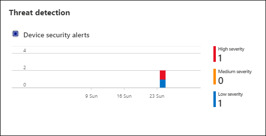

# 연습 5: IoT 보호	

## 시나리오

IoT 솔루션을 출시할 때 CTO는 솔루션의 전반적인 보안 상태를 철저하게 파악해야 합니다. 특히 STRIDE(사용자 ID 스푸핑, 변조, 부인, 정보 공개, 서비스 거부, 권한 상승) 위협 유무를 자세히 확인해야 합니다.

이 연습에서는 솔루션의 전반적인 보안 상태를 유지하는 방법을 파악합니다.


## 개요

이 연습에서는 다음 활동을 완료합니다.

* Azure Security Center for IoT를 사용하도록 설정
* 보안 모듈 쌍 작성
* Linux 컴퓨터에 Security Center 에이전트 설치
* 모니터링되는 리소스 구성
* 사용자 지정 경고 작성
* Azure Security Center에서 경고 검토

## 지침

### 작업 1: Azure Security Center for IoT Hub를 사용하도록 설정

Azure Security Center for IoT에서는 보안 관리 과정을 통합할 수 있으며, 하이브리드 클라우드 워크로드와 Azure IoT 솔루션 전반에 걸쳐 위협 검색과 분석을 수행할 수 있습니다. 다음 링크를 방문하면 Azure Security Center for IoT에 대해 자세히 알아볼 수 있습니다. ```https://docs.microsoft.com/en-us/azure/asc-for-iot/overview``` 

Azure Security Center for IoT는 기존 IoT 디바이스 관리 플랫폼과 완벽하게 통합할 수 있습니다. 따라서 디바이스 보안 상태를 관리할 수 있을 뿐 아니라 기존 디바이스 제어 기능도 활용할 수 있습니다.


이 작업에서는 IoT Hub용으로 **Azure Security Center for IoT**를 사용하도록 설정합니다. 

1. 리소스 그룹 타일에서 **iot-{deployment-id}**을(를) 클릭하고 기존 IoT Hub **iothub-{deployment-id}**을(를) 선택합니다.

1. 왼쪽 메뉴의 **보안** 아래에서 **개요**를 클릭합니다.

    보안 창을 처음 열면 Azure Security Center for IoT Hub가 등록됩니다. 

1. **IoT 솔루션 보호** 단추가 표시되는 경우 **IoT 솔루션 보호**를 클릭한 후 메시지가 표시되면 브라우저 창을 새로 고칩니다.

   

1. 변경 내용이 적용되도록 ```https://portal.azure.com```에서 로그아웃했다가 다시 로그인합니다.

   > **참고**: 로그아웃하기 전에 표시되는 권한 없음 관련 경고는 무시하면 됩니다. 다시 로그인하면 권한이 전파되기 때문입니다.

1. IoT Hub로 다시 이동하여 왼쪽 메뉴의 **보안** 아래에서 **개요**를 선택합니다.

1. **보안 개요** 창의 내용을 잠시 검토합니다.

    > **참고**: Azure Security Center for IoT를 등록하는 즉시 위협이 바로 검색되지는 않습니다. 이 랩을 끝내기 전에 검색된 위협이 개요 창에서 보고되기 시작합니다. 

#### Log Analytics 작성

Azure Security Center for IoT를 설정하면 IoT 디바이스, IoT Edge 및 IoT Hub 관련 원시 보안 이벤트, 경고 및 권장 사항 저장을 위해 기본 Azure Log Analytics 작업 영역이 작성됩니다.

Log Analytics 작업 영역은 Azure Monitor 로그 데이터에 사용되는 고유한 환경입니다. 각 작업 영역에서는 자체 데이터 리포지토리 및 구성이 사용됩니다. 데이터 원본 및 솔루션은 특정 작업 영역에 데이터를 저장하도록 구성됩니다. 이러한 데이터를 저장하려면 Azure Log Analytics for Security Center가 필요합니다.

이 작업에서는 Azure Security Center용 Log Analytics 작업 영역을 만듭니다.

1. IoT Hub의 보안 개요 창을 엽니다.

1. 왼쪽 메뉴의 **보안** 아래에서 **설정**을 클릭하여 보안 설정을 표시합니다. 

    **설정 페이지** 블레이드가 열리고 **이름** 아래에 **데이터 수집** 옵션이 표시됩니다.
    
1. **데이터 수집**을 선택하고 표시되는 설정 정보를 잠시 검토합니다.
   
   

    > **참고**: Log Analytics 작업 영역용으로 정의된 **작업 영역 구성**을 확인하세요. Azure Security Center for IoT 솔루션을 설정하면 기본적으로 Azure 구독에 포함된 모든 IoT Hub가 자동으로 보호됩니다. Log Analytics 작업 영역이 표시될 때까지 다소 시간이 걸릴 수도 있습니다.

1. Log Analytics 작업 영역이 아직 구성되어 있지 않으면 **작업 영역 구성** 아래에서 **새 작업 영역 만들기**를 클릭합니다.

1. **Log Analytics 작업 영역** 창에 **iotworkspace-{deployment-id}** 등의 고유한 이름을 입력합니다. 나머지 설정은 기본값으로 유지하고 **확인**을 클릭합니다.

1. 배포가 정상적으로 완료되면 **작업 영역** 드롭다운에서 방금 만든 작업 영역을 선택합니다.

1. **저장**을 클릭하여 데이터 수집 구성을 저장합니다.

### 작업 2: 보안 모듈 쌍 작성

디바이스 쌍은 메타데이터, 구성, 조건 등의 디바이스 상태 정보가 저장되는 JSON 문서입니다. Azure IoT Hub에서는 IoT Hub에 연결하는 각 디바이스용 디바이스 쌍을 유지 관리합니다. 디바이스 쌍에 대한 자세한 내용은 ```https://docs.microsoft.com/en-us/azure/iot-hub/iot-hub-devguide-device-twins```를 참조하세요.

모듈 쌍도 디바이스 쌍과 마찬가지로 메타데이터, 구성, 조건 등의 모듈 상태 정보가 저장되는 JSON 문서입니다. Azure IoT Hub에서는 IoT Hub에 연결하는 각 모듈용 모듈 쌍을 유지 관리합니다. 모듈 쌍에 대한 자세한 내용은 ```https://docs.microsoft.com/en-us/azure/iot-hub/iot-hub-devguide-module-twins```를 참조하세요.

Azure Security Center for IoT에서는 모듈 쌍 메커니즘을 활용하며, 각 디바이스용으로 보안 모듈 쌍 "azureiotsecurity"를 유지 관리합니다. 보안 모듈 쌍에는 각 디바이스의 디바이스 보안과 관련된 모든 정보가 저장됩니다. Azure Security Center for IoT 기능을 최대한 활용하려면 새 IoT Edge 디바이스용으로 이러한 보안 모듈 쌍을 작성, 구성 및 사용해야 합니다.

보안 모듈 쌍에는 각 디바이스의 디바이스 보안과 관련된 모든 정보가 저장됩니다.

다음의 두 가지 방법 중 하나를 사용하여 보안 모듈 쌍(**azureiotsecurity**)을 만들 수 있습니다.

* 모듈 배치 스크립트(```https://github.com/Azure/Azure-IoT-Security/tree/master/security_module_twin```)를 사용합니다. 이 스크립트를 실행하면 기본 구성을 사용하여 새 디바이스 또는 모듈 쌍이 없는 디바이스용 모듈 쌍이 자동으로 작성됩니다.

* 각 디바이스에 맞는 특정 구성을 사용하여 각 모듈 쌍을 개별적으로 수동 편집합니다.

이 작업에서는 보안 모듈 쌍을 수동으로 만듭니다.

1. 리소스 그룹 타일로 이동하여 **iot-{deployment-id}**을(를) 클릭하고 IoT Hub **iothub-{deployment-id}**을(를) 선택합니다.

1. 왼쪽 메뉴의 **탐색기** 아래에서 **IoT 디바이스**를 클릭합니다.

1. **디바이스 ID** 아래에서 **turbine-01**을 클릭합니다.

1. **turbine-01** 블레이드 위쪽의 **+ 모듈 ID 추가**를 클릭합니다.

1. **모듈 ID 추가** 창의 **모듈 ID 이름** 아래에 **azureiotsecurity**를 입력합니다.

    인증에는 대칭 키를 사용할 것이므로 나머지 필드는 모두 기본값으로 두면 됩니다.

1. 창 아래쪽에서 **저장**을 클릭합니다.

1. 이제 **turbine-01** 블레이드의 **모듈 ID** 아래에 **azureiotsecurity** 디바이스가 표시됩니다.

    디바이스의 연결 상태는 **연결 끊김**입니다.
    
    

    > **중요**: 모듈 ID는 **azureiotsecurity**로 지정해야 하며 다른 고유한 이름을 입력해서는 안 됩니다.

1. **turbine-01** 블레이드의 **기본 키** 오른쪽에 있는 **복사**를 클릭하여 나중에 사용할 수 있도록 키 값을 저장합니다.

    > **참고**: 연결 문자열이 아닌 디바이스의 **기본 키**를 복사해야 합니다.

    

1. IoT Hub 블레이드로 돌아옵니다.

1. 왼쪽 메뉴에서 **개요**를 클릭합니다.

1. 블레이드 위쪽의 필수 영역 내 **호스트 이름** 오른쪽에 있는 **클립보드에 복사**를 클릭하여 나중에 사용할 수 있도록 값을 저장합니다.

    > **참고**: IoT Hub 호스트 이름은 iothub-2144XX.azure-devices.net 형식입니다.

### 작업 3: Azure Security Center for IoT 보안 에이전트 배포

Azure Security Center for IoT 보안 에이전트는 IoT 디바이스에서 데이터를 수집하며, 검색된 취약성 완화를 위한 보안 조치를 수행합니다. 사용자 지정 가능한 모듈 쌍 속성 집합을 통해 보안 에이전트 구성을 제어할 수 있습니다. 일반적으로 이러한 속성의 2차 업데이트는 거의 진행되지 않습니다.

C 및 C# 기반 에이전트를 사용할 수 있습니다. 모든 Azure Security Center for IoT 보안 에이전트 유형은 같은 기능 집합을 제공하며 비슷한 구성 옵션을 지원합니다.

제한 수준이 높거나 리소스를 최소한으로만 사용할 수 있는 디바이스의 경우에는 C 에이전트를 사용하는 것이 좋습니다.

이 작업에서는 시뮬레이트된 디바이스에 보안 에이전트를 배포합니다. 

#### Linux VM에 로그인

1. Azure Portal에서 Linux 컴퓨터 **linuxagentvm-{deployment-id}**에 로그인합니다. 이렇게 하려면 Azure 홈페이지에서 리소스 그룹을 선택한 다음 목록에서 **linuxagentvm-{deployment-id}** Linux VM 리소스를 선택합니다.

1. 블레이드 위쪽에서 **연결**을 클릭하고 **SSH**를 클릭합니다.

1. 샘플 SSH 명령을 사용하여 VM 연결용 명령을 작성합니다.

   예제 명령을 텍스트 편집기에 복사한 다음 명령에서 `-i <프라이빗 키 경로>를 제거합니다. 이 부분을 제거한 명령의 형식은 다음과 같습니다.

    ```cmd\sh
    ssh <admin user>@<ip address>
    ```

    실제 명령은 `ssh demouser@52.170.205.79`와 같이 표시됩니다.

1. Azure Portal 도구 모음에서 **Cloud Shell**을 클릭합니다.

    Cloud Shell 내에서 **Bash** 환경이 선택되어 있는지 확인합니다.

1. Cloud Shell 명령 프롬프트에서 이전 단계에서 작성한 `ssh` 명령을 입력하고 **Enter** 키를 누릅니다.

1. **Are you sure you want to continue connecting?(계속 연결하시겠습니까?)**이라는 메시지가 표시되면 **yes(예)**를 입력하고 **Enter** 키를 누릅니다.

    VM 연결을 보호하는 데 사용하는 인증서는 자체 서명 인증서이므로, 보안 확인을 위해 이 메시지가 표시됩니다. 첫 번째 연결에서만 메시지가 표시되며, 후속 연결에서는 이 메시지에서 입력한 답변이 계속 사용됩니다.

1. 암호를 입력하라는 메시지가 표시되면 **Password.1!!**를 입력합니다.

    VM에 연결되면 터미널 명령 프롬프트가 변경되어 다음과 같이 Linux VM의 이름이 표시됩니다.

    ```cmd/sh
    demouser@linuxagentvm-{your-id}:~$
    ```

    따라서 연결되어 있는 VM과 현재 사용자를 쉽게 추적할 수 있습니다.

#### 디바이스에 대칭 키 추가

보안 에이전트를 사용하여 IoT Hub에 연결할 수 있습니다. 연결을 구현하려면 디바이스의 대칭 키나 인증서 정보가 필요합니다.

이 랩에서는 인증 방법으로 대칭 키를 사용합니다. 디바이스의 임시 텍스트 문서에 이 대칭 키를 저장해야 합니다.

1. **turbine-01** IoT 디바이스의 **기본 키** 값을 사용할 수 있는지 확인합니다.

   > **참고**: 기본 키 값은 이 랩의 앞부분에서 이미 저장한 상태여야 합니다. 키 값을 저장하지 않았다면 다음 단계를 완료합니다.

    1. 리소스 그룹으로 이동하여 IoT Hub **iothub-{deployment-id}**을(를) 선택합니다.
    1. 왼쪽 메뉴의 **탐색기** 아래에서 **IoT 디바이스**를 클릭합니다.
    1. **디바이스 ID** 아래에서 **turbine-01**을 클릭합니다.
    1. 세부 정보 목록에서 **기본 키**를 복사합니다.
    1. Azure Cloud Shell로 돌아옵니다. **linuxagentvm-{deployment-id}** 가상 머신에 계속 연결되어 있는 상태여야 합니다.

1. Cloud Shell 명령 프롬프트에서 다음 명령을 입력합니다.

    ```cmd/sh
    echo "<primary_key>" > s.key
    ```

    이 명령을 실행하면 **turbine-01** 디바이스의 **기본 키**를 사용하여 디바이스 인증 유형 파일이 작성됩니다.

    > **참고**: 파일에 올바른 기본 키를 추가했는지 확인하려면 `nano s.key` 명령을 실행하여 파일을 엽니다. 파일에 디바이스의 **기본 키**가 포함되어 있는지 확인합니다. nano 편집기를 끝내려면 `Ctrl`+`X`를 누릅니다. `Shift`+`Y`를 눌러 파일을 저장한 후에 Enter 키를 누릅니다.

#### 보안 에이전트 설치

1. Cloud Shell 세션이 SSH를 통해 VM에 계속 연결되어 있는지 확인합니다.

1. Cloud Shell 명령 프롬프트에서 다음 명령을 사용자 지정한 후에 실행합니다. 

    자리 표시자 값을 인증 매개 변수로 바꿔야 합니다.

    ```bash
    cd /var/ASCIoTAgent
    sudo ./InstallSecurityAgent.sh -i -aui Device -aum SymmetricKey -f <Insert file location of your s.key file> -hn <Insert your full IoT Hub host name> -di <Device name>
    ```

    실행해야 하는 명령의 예제는 다음과 같습니다.

    ```bash
    sudo ./InstallSecurityAgent.sh -i -aui Device -aum SymmetricKey -f /home/demouser/s.key -hn iothub-214XXX.azure-devices.net -di turbine-01`
    ```

    > **참고**: 아래에 나와 있는 호스트 이름 대신 실제 IoT Hub 호스트 이름을 지정해야 합니다. 
    > pwd 명령을 사용하면 파일 위치를 찾을 수 있습니다.
   
    > **중요**:
    > `-hn` 스위치 값으로는 **iothub-{deployment-id}.azure-devices.net**과 같이 전체 IoT Hub 호스트 이름을 사용해야 합니다.

    이 스크립트는 다음 작업을 수행합니다.

    * 필수 구성 요소를 설치합니다.
    * 대화형 로그인이 사용하지 않도록 설정된 서비스 사용자를 추가합니다.
    * 디바이스가 서비스 관리에 **systemd**를 사용한다고 간주하여 에이전트를 디먼으로 설치합니다.
    * 에이전트가 특정 작업을 루트 권한으로 수행할 수 있도록 **sudo users**를 구성합니다.
    * 제공된 인증 매개 변수를 사용하여 에이전트를 구성합니다.

1. Cloud Shell 터미널의 출력을 감시하여 명령 실행 진행률을 관찰합니다.
   
1. Azure Security Center for IoT 에이전트의 배포 상태를 확인하려면 Cloud Shell 명령 프롬프트에서 다음 명령을 입력합니다. 

    ```cmd/sh
    systemctl status ASCIoTAgent.service
    ```

    그러면 다음과 같은 출력이 표시됩니다.

    

    구체적으로는 서비스가 **Loaded: loaded(로드됨: 로드됨)** 및 **Active: active (running)(활성: 활성(실행 중))** 상태인지를 확인해야 합니다. 서비스 상태가 not running인 경우 "sudo reboot" 명령을 실행하여 가상 머신을 다시 시작한 후 VM에 다시 연결하여 서비스가 Active 상태인지를 확인하면 됩니다.

1. 리소스 그룹 타일에서 **iot-{deployment-id}**(으)로 이동하여 기존 IoT Hub **iothub-{deployment-id}**을(를) 선택합니다.

    IoT Hub 블레이드를 열고 **탐색기** 아래 탐색 메뉴에서 **IoT 디바이스**를 클릭한 다음 **turbine-01**을 클릭합니다.

1. 이제 **모듈 ID** 아래에 **azureiotsecurity** 모듈의 상태가 **Connected**로 표시됩니다.

    

디바이스에 Azure Security Center for IoT 디바이스 에이전트를 설치했으므로 이에전트가 디바이스에서 원시 보안 이벤트를 수집, 집계 및 분석할 수 있습니다.

### 작업 4: Azure Security Center for IoT 구성

Azure Security Center for IoT를 사용하면 전체 IoT 솔루션을 대시보드 하나에서 모니터링할 수 있습니다. 이 대시보드에는 Azure의 모든 IoT 디바이스, IoT 플랫폼 및 백 엔드 리소스가 표시됩니다.

IoT Hub에서 사용하도록 설정된 Azure Security Center for IoT는 IoT Hub에 연결되어 있는 IoT 솔루션 관련 기타 Azure 서비스를 자동으로 확인합니다.

이와 같이 관계를 자동으로 검색할 수 있을 뿐 아니라, IoT 솔루션의 일부분으로 태그를 지정할 다른 Azure 리소스 그룹도 선택할 수 있습니다. 그룹을 선택하면 전체 구독, 리소스 그룹 또는 리소스 하나를 추가할 수 있습니다.

#### IoT Hub 열기

1. 브라우저에서 Azure Portal을 열고 IoT Hub로 이동합니다.

1. 왼쪽 메뉴의 **보안** 아래에서 **설정**을 클릭합니다.

1. **설정 페이지**에서 **이름** 아래의 **모니터링되는 리소스**를 선택합니다.

1. 창 위쪽에서 **편집**을 클릭합니다.

    그러면 열리는 **솔루션 관리** 창에서 리소스 그룹을 선택하여 보안 솔루션에 추가 Azure 리소스를 연결할 수 있습니다.

1. **구독** 아래에서 액세스 권한이 있는 구독을 선택합니다.

1. **리소스 그룹** 드롭다운에서 **iot-{deployment-id}**을(를) 클릭합니다.

1. **솔루션 관리** 창 아래쪽에서 **적용**을 클릭합니다.

    **적용** 단추를 사용할 수 없는 경우에는 리소스가 이미 추가된 것이므로 더 추가하지 않아도 됩니다.

1. **솔루션 관리** 창과 **리소스** 블레이드를 닫고 IoT Hub 개요 페이지로 돌아옵니다.

리소스 관계를 모두 정의하고 나면 Azure Security Center for IoT에서 Azure Security Center를 활용하여 해당 리소스와 관련된 보안 권장 사항 및 경고를 제공합니다.

#### Azure Security Center for IoT의 실제 작동 방식 확인

지금까지 디바이스에 보안 에이전트를 설치하고 솔루션을 구성했습니다. 이제 Azure Security Center for IoT의 다양한 보기를 확인할 수 있습니다.

1. 왼쪽 메뉴의 **보안** 아래에서 **개요**를 클릭합니다. 

    디바이스, 허브 및 기타 리소스의 상태 개요가 차트 2개에 표시됩니다. Azure IoT Security Center를 설정하는 즉시 사용하도록 설정되는 기본 제공 실시간 모니터링, 권장 사항 및 경고도 확인할 수 있습니다.

    아래 이미지에는 보안 평가 수행 후의 대시보드 상태가 나와 있습니다.
    
    

    > **중요**:
    > IoT 리소스의 보안 구성을 평가하는 프로세스 실행에는 최대 24시간이 걸릴 수 있습니다. 그러므로 대시보드에 표시되는 초기 상태에는 리소스의 실제 상태가 반영되지 않습니다. 
    
### 작업 5: 사용자 지정 경고 추가

사용자 지정 보안 그룹 및 경고를 사용하면 IoT 솔루션 전반에 걸쳐 종단 간 보안 정보 및 범주별 디바이스 지식을 최대한 활용할 수 있습니다. 따라서 솔루션의 보안을 강화할 수 있습니다. 

Azure Security Center for IoT에서는 이와 같이 파악한 정보를 디바이스 동작 정책에 반영하여 정상적인 동작과 다른 동작이 확인되면 경고를 생성할 수 있습니다.

#### 경고 사용자 지정

위에서 언급한 것처럼, 솔루션의 정상 동작을 구체적으로 파악하고 있는 고객은 특정 동작이 필요한 동작의 범위를 벗어나면 트리거되는 사용자 지정 경고를 구성할 수 있습니다. 이 연습에서는 **MQTT** 프로토콜을 통해 전송되는 **클라우드의 디바이스** 메시지를 모니터링하는 사용자 지정 경고를 작성합니다.

1. **IoT 시뮬레이터 앱**을 열어 디바이스에 대한 원격 분석 데이터 전송을 시작합니다.

1. Azure Portal에서 IoT Hub 블레이드로 이동합니다.

1. 왼쪽 메뉴의 **보안** 아래에서 **설정**을 클릭합니다.

1. **설정 페이지** 창이 표시되면 **이름** 아래의 **사용자 지정 경고**를 선택합니다.

1. **사용자 지정 경고** 창을 잠시 검토합니다.

    처음에는 이 창에 아무 내용도 없는 것처럼 보입니다. 하지만 **이름** 아래에 나열된 항목은 실제로는 자동으로 작성된 **default** 보안 그룹입니다.

    보안 그룹을 사용하면 디바이스의 논리적 그룹을 정의하고 중앙 집중식으로 디바이스의 보안 상태를 관리할 수 있습니다. 이러한 그룹은 특정 하드웨어가 설치된 디바이스, 특정 위치에 배포된 디바이스 또는 사용자의 특정 요구에 적합한 기타 모든 그룹을 나타낼 수 있습니다.

1. default 보안 그룹에 사용자 지정 경고를 추가하려면 **default**를 클릭합니다.

    **디바이스 보안 그룹** 블레이드에는 활성 사용자 지정 경고가 모두 나열됩니다. 지금은 이 블레이드를 처음 표시했기 때문에 아무 내용도 표시되지 않습니다.

1. 블레이드 위쪽에서 **사용자 지정 경고 규칙 만들기**를 클릭합니다.

    **사용자 지정 경고 규칙 만들기** 창이 열립니다. **디바이스 보안 그룹** 필드에는 **default** 그룹이 입력되어 있습니다.

1. **사용자 지정 경고** 드롭다운에서 **클라우드의 메시지 수(MQTT 프로토콜)가 허용 범위에 있지 않음**을 클릭합니다.

    > **팁**:
    > 제공되는 여러 사용자 지정 경고를 검토하여 솔루션을 보호하는 데 사용할 수 있는 방법을 고려해 보세요.

    > **참고**:
    > 선택한 **사용자 지정 경고**에 따라 **설명** 및 **필수 속성**이 변경됩니다.

1. **필수 속성**의 **최소 임계값** 필드에 **1**을 입력합니다.

    이 값은 5분 동안 메시지가 하나 이상 전송되어야 한다는 의미입니다.

1. **최대 임계값**에는 **5**를 입력합니다.

    이 값은 5분 동안 메시지가 5개까지만 전송되어야 한다는 의미입니다.

1. **기간 크기** 드롭다운에서 **00:05:00**을 클릭합니다.

1. **사용자 지정 경고 규칙 만들기** 창 아래쪽에서 **확인**을 클릭합니다.

1. **default**(디바이스 보안 그룹) 블레이드 위쪽에서 **저장**을 클릭합니다.

    새 경고는 저장하지 않으면 다음번에 IoT Hub를 닫을 때 삭제됩니다. 경고를 저장하면 사용자 지정 경고 목록이 다시 표시됩니다. 
    
### 작업 6: 디바이스 쌍을 사용하는 IoT 디바이스

#### 디바이스 쌍을 사용하여 IoT 디바이스 구성

> *디바이스 쌍*은 메타데이터, 구성, 조건 등의 디바이스 상태 정보가 저장되는 JSON 문서입니다. Azure IoT Hub에서는 IoT Hub에 연결하는 각 디바이스용 디바이스 쌍을 유지 관리합니다.

디바이스는 IoT Hub에 등록을 해야 연결이 가능합니다.

1. Azure Portal에서 IoT Hub 블레이드로 이동합니다.

1. 왼쪽 메뉴의 **탐색기** 아래에서 **IoT 디바이스**를 클릭합니다.

1. **IoT 디바이스** 창 위쪽에서 **turbine-01**을 클릭합니다.

1. 디바이스 쌍을 표시하려면 **디바이스 쌍**을 클릭합니다.

    다음과 같은 기존 디바이스 쌍 JSON이 표시됩니다.

    ```json
    {
        "deviceId": "turbine-01",
        "etag": "AAAAAAAAAAE=",
        "deviceEtag": "Mjg2NzY5NzAw",
        "status": "enabled",
        "statusUpdateTime": "0001-01-01T00:00:00Z",
        "connectionState": "Disconnected",
        "lastActivityTime": "0001-01-01T00:00:00Z",
        "cloudToDeviceMessageCount": 0,
        "authenticationType": "sas",
        "x509Thumbprint": {
            "primaryThumbprint": null,
            "secondaryThumbprint": null
        },
        "version": 2,
        "tags": {
            "SecurityGroup": "default"
        },
        "properties": {
            "desired": {
                "$metadata": {
                    "$lastUpdated": "2020-06-11T13:09:38.4712899Z"
                },
                "$version": 1
            },
            "reported": {
                "$metadata": {
                    "$lastUpdated": "2020-06-11T13:09:38.4712899Z"
                },
                "$version": 1
            }
        },
        "capabilities": {
            "iotEdge": false
        }
    }
    ```

1. **default** 보안 그룹에 디바이스를 추가하려면 **version** 및 **properties** 필드 사이에 다음 JSON을 삽입합니다.

    ```json
    "tags": {
        "SecurityGroup": "default"
    },
    ```

    완성된 JSON은 다음과 같습니다.

    ```json
    {
        "deviceId": "turbine-01",
        "etag": "AAAAAAAAAAE=",
        "deviceEtag": "Mjg2NzY5NzAw",
        "status": "enabled",
        "statusUpdateTime": "0001-01-01T00:00:00Z",
        "connectionState": "Disconnected",
        "lastActivityTime": "0001-01-01T00:00:00Z",
        "cloudToDeviceMessageCount": 0,
        "authenticationType": "sas",
        "x509Thumbprint": {
            "primaryThumbprint": null,
            "secondaryThumbprint": null
        },
        "version": 2,
        "tags": {
            "SecurityGroup": "default"
        },
        "properties": {
            "desired": {
                "$metadata": {
                    "$lastUpdated": "2020-06-11T13:09:38.4712899Z"
                },
                "$version": 1
            },
            "reported": {
                "$metadata": {
                    "$lastUpdated": "2020-06-11T13:09:38.4712899Z"
                },
                "$version": 1
            }
        },
        "capabilities": {
            "iotEdge": false
        }
    }
    ```

1. 업데이트된 JSON을 적용하려면 **저장**을 클릭합니다.

1. **디바이스 쌍** 창을 닫고 Azure Portal을 최소화합니다.

1. **IoT 시뮬레이터 앱**을 연 다음 **원격 분석 보내기** 단추를 클릭하여 원격 분석 데이터 전송을 시작합니다.

### 작업 7: Security Center 경고 검토

이제 콘솔 앱이 앞에서 만든 사용자 지정 경고가 트리거되기에 충분한 원격 분석을 전송했을 것입니다. 

> **참고**: 경고는 5분 동안 디바이스에서 클라우드로 전송한 메시지 수가 1개 미만이거나 5개를 초과하면 트리거되도록 설정되었습니다.

#### Security Center 대시보드 검토

1. Azure Portal에서 IoT Hub 블레이드로 이동합니다.

1. 왼쪽 메뉴의 **보안** 아래에서 **개요**를 클릭합니다.

    **위협 검색** 섹션을 확인합니다. **디바이스 보안 경고** 차트에 경고가 하나 이상 표시되어야 합니다.

    

    그리고 **경고가 가장 많은 디바이스** 타일에 **turbine01** 디바이스의 항목이 표시되어야 합니다.

    > **참고**: 대시보드에 경고가 표시되려면 15~20분 정도 걸릴 수 있습니다.

1. **위협 검색** 아래에서 **경고가 가장 많은 디바이스** 타일을 클릭합니다.

    그러면 왼쪽 메뉴에서 **보안** 아래의 **보안 경고**를 클릭하면 표시되는 것과 같은 **경고** 블레이드가 열립니다.

    이 블레이드에는 보안 경고 목록이 표시됩니다.

    

    최신 경고에는 **신규** 레이블이 표시됩니다.

1. Azure Portal을 최소화하고 **IoT 시뮬레이터 앱**을 엽니다.

1. **원격 분석 중지** 단추를 클릭하여 원격 분석 데이터 전송을 중지합니다.


이 연습에서는 IoT 솔루션을 보호하는 방법을 알아보았습니다. 이상으로 랩을 마칩니다. 

